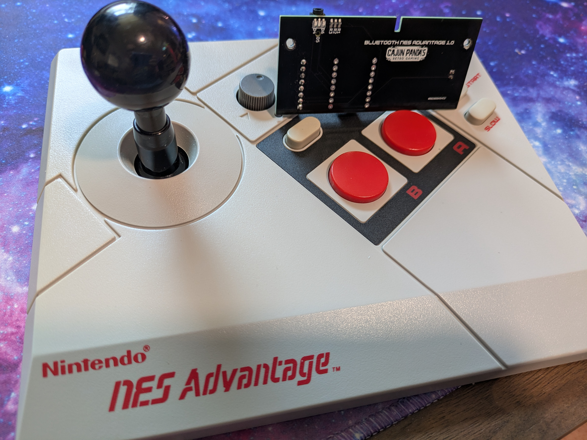

# Bluetooth NES Advantage

Integrated Bluetooth for the NES Advantage (NES-026) arcade stick. It pairs directly with a
Nintendo Switch, an 8BitDo NES Retro Receiver (for a real NES), and PCs, phones, and emulators
over BLE. No case cutting and no added buttons: everything runs from the stick's own controls,
and it charges through the original cable hole.

## How it works

A single custom PCB replaces the controller's cable. A bare ESP32-WROOM-32E reads the original
CD4021 shift registers and presents the stick as a Bluetooth gamepad in one of two modes:

- Switch mode (Bluetooth Classic): emulates a Switch Pro Controller. Pairs directly with a
  Nintendo Switch and with the 8BitDo NES Retro Receiver.
- BLE mode: a standard BLE HID gamepad ("NES Advantage") for PCs, phones, BlueRetro, and
  emulators.

Turbo, slow motion, and the player-select slider all work as originally designed.

## Features

- Direct Nintendo Switch pairing (Switch Pro Controller emulation over BT Classic)
- 8BitDo NES Retro Receiver support for playing on a real NES
- BLE gamepad mode for PC, Android, SteamOS, Linux, and BlueRetro
- Turbo and slow motion work as normal
- Player-select slider: in BLE mode the stick exposes two gamepads for take-turns play
- Wake on button press from a deep sleep that draws microamps
- Low input latency (send-on-change, 7.5 ms BLE connection interval)
- Browser-based configuration and over-the-air firmware updates, no cable needed
- RGB status LEDs, battery level monitoring, 5 V barrel jack charging
- Play while charging (load-share power path)

## Documentation

Start with the guide that fits you:

- **Using a modded controller:** [docs/MANUAL.md](docs/MANUAL.md). Pairing, gestures, LEDs, button
  profiles, two-player play, charging, and firmware updates.
- **Installing the mod in your controller:** [docs/INSTALL.md](docs/INSTALL.md). Wiring the harness,
  fitting the battery and board, insulating tape, and the 3D-printed jack plug.
- **Building your own kit:** [docs/HARDWARE.md](docs/HARDWARE.md). PCB, bill of materials, board
  assembly, connection maps, and the power path.
- **Building and customizing firmware:** [docs/FIRMWARE.md](docs/FIRMWARE.md). Toolchain, module
  layout, architecture, and the config/OTA path.

## Get one prebuilt

Prebuilt kits and assembled units will be available at [cajunpanda.com](https://cajunpanda.com).

## Repository layout

| Path | Contents |
|---|---|
| [`firmware/`](firmware/) | ESP-IDF dual-mode Bluetooth firmware |
| [`hardware/`](hardware/) | KiCad PCB project and the 3D-printable jack plug |
| [`web/`](web/) | Web Bluetooth config and OTA update page |
| [`tools/`](tools/) | Serial monitor and build helpers |
| [`docs/`](docs/) | Manual, install guide, hardware guide, firmware guide, protocol reference |
| [`AGENTS.md`](AGENTS.md) | Working notes for contributors and AI coding agents |

## License

Licensed by medium: firmware and software under MIT, hardware (PCB and 3D models) under
CERN-OHL-P-2.0, documentation under CC-BY-4.0. See [LICENSING.md](LICENSING.md).
