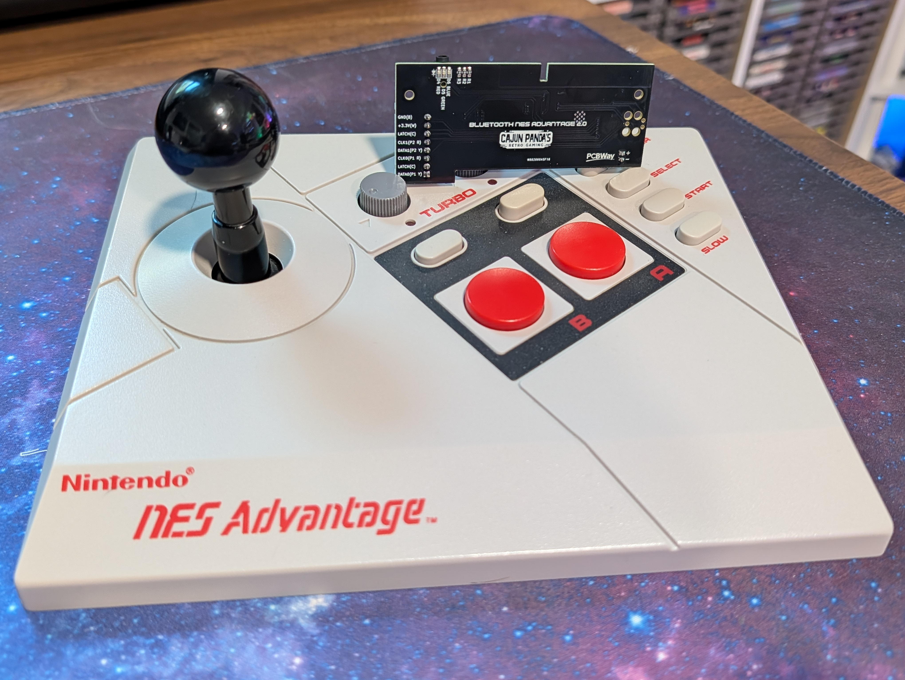
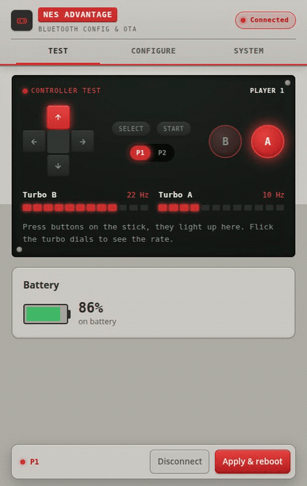
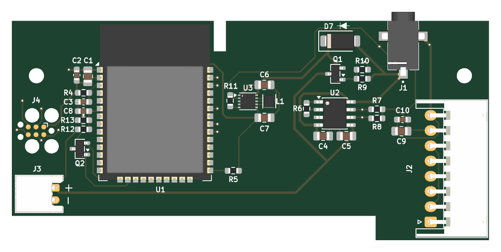
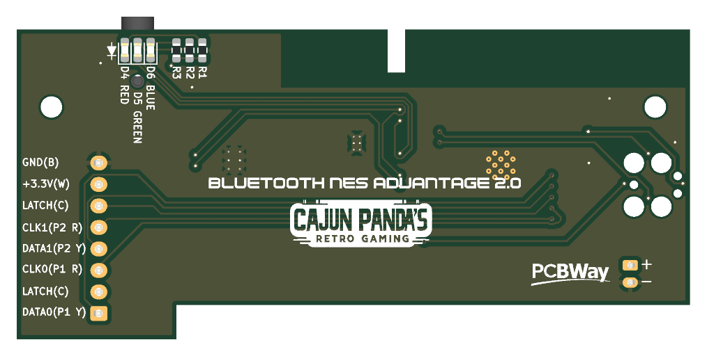

# Bluetooth NES Advantage (v2)

Integrated Bluetooth for the NES Advantage (NES-026) arcade stick. It pairs directly with a
Nintendo Switch, an 8BitDo NES Retro Receiver (for a real NES), and PCs, phones, and emulators
over BLE. No case cutting and no added buttons: everything runs from the stick's own controls,
and it charges through the original cable hole.

## Features

- Direct Nintendo Switch pairing (Switch Pro Controller emulation over BT Classic)
- Home, ZL + ZR (the NSO retro menu), ZL, ZR, and Capture — buttons the NES stick never had, on
  Select-held chords, instant and usable mid-game
- 8BitDo NES Retro Receiver support for playing on a real NES
- BLE gamepad mode for PC, Android, SteamOS, Linux, and BlueRetro
- Turbo and slow motion work as normal
- Player-select slider: in BLE mode the stick exposes two gamepads for take-turns play
- Wake on button press from a deep sleep that draws microamps
- Battery life on an 1800 mAh cell: about 17 hours in Switch/Receiver mode, about 37 hours in
  BLE mode, months of standby
- Low input latency: the board adds about 4 ms in Switch/Receiver mode and about 6 ms in BLE mode
- Browser-based configuration and over-the-air firmware updates, no cable needed
- RGB status LEDs, battery level monitoring, 5 V barrel jack charging
- Play while charging (load-share power path)

## Configure and update from your browser

A built-in Web Bluetooth app tests every input, tunes how the stick behaves, and flashes new
firmware over the air with no cable and nothing to install. Put the stick in config mode (hold
A + B + Select for 5 s), open the hosted
**[config page](https://cajunpanda.github.io/bluetooth-nes-advantage/)** in Chrome or Edge, and
connect. Every button, the D-pad, the player-select slider, and the turbo dials light up live as
you use them:

Change transport, button profile, and directional mode and apply over the air, or drop a
`firmware.bin` on the cartridge slot to update. The
[manual](docs/MANUAL.md#configuration-and-firmware-updates) has the full walkthrough.

## How it works

A single custom PCB replaces the controller's cable. A bare ESP32-WROOM-32E reads the original
CD4021 shift registers and presents the stick as a Bluetooth gamepad in one of two modes:

- Switch mode (Bluetooth Classic): emulates a Switch Pro Controller. Pairs directly with a
  Nintendo Switch and with the 8BitDo NES Retro Receiver.
- BLE mode: a standard BLE HID gamepad ("NES Advantage") for PCs, phones, BlueRetro, and
  emulators.

Turbo, slow motion, and the player-select slider all work as originally designed.

## Documentation

Start with the guide that fits you:

- **Using a modded controller:** [docs/MANUAL.md](docs/MANUAL.md). Pairing, gestures, LEDs, button
  profiles, two-player play, charging, and firmware updates.
- **Installing the mod in your controller:** [docs/INSTALL.md](docs/INSTALL.md). Wiring the harness,
  fitting the battery and board, insulating tape, and the 3D-printed jack plug.
- **Building your own kit:** [docs/HARDWARE.md](docs/HARDWARE.md). PCB, bill of materials, board
  assembly, and connection maps.
- **Building and customizing firmware:** [docs/FIRMWARE.md](docs/FIRMWARE.md). Toolchain, module
  layout, architecture, and the config/OTA path.

## Get one prebuilt

Complete kits and assembled boards are available at
[cajunpanda.com](https://cajunpanda.com/shop/bt-nes-advantage).

## Support

Questions and help: join the [Discord](https://discord.gg/t8uT8NgTnc).

## Repository layout

| Path                     | Contents                                                                  |
| ------------------------ | ------------------------------------------------------------------------- |
| [`firmware/`](firmware/) | ESP-IDF dual-mode Bluetooth firmware                                      |
| [`hardware/`](hardware/) | KiCad PCB project and the 3D-printable jack plug                          |
| [`web/`](web/)           | Web Bluetooth config and OTA update page                                  |
| [`tools/`](tools/)       | Serial monitor and build helpers                                          |
| [`docs/`](docs/)         | Manual, install guide, hardware guide, firmware guide, protocol reference |
| [`AGENTS.md`](AGENTS.md) | Working notes for contributors and AI coding agents                       |

## License

Licensed by medium: firmware and software under MIT, hardware (PCB and 3D models) under
CERN-OHL-P-2.0, documentation under CC-BY-4.0. See [LICENSING.md](LICENSING.md).

## PCBs

The PCBs for this product are sponsored and produced by PCBWay. As always, their service was amazing
and the fabrication as well as the shipping was fast. Because of the all-in-one customs and shipping
price, the handling of taxes and other fees was very easy.
[Click here](https://www.pcbway.com/project/shareproject/Bluetooth_NES_Advantage_865d24ef.html) to
order the PCBs from the shared project (gerbers preloaded).

## Disclaimer

This is an independent, unofficial project and is not affiliated with, endorsed by, sponsored by, or
associated with Nintendo Co., Ltd. Nintendo, NES, Nintendo Entertainment System, NES Advantage,
Nintendo Switch, and Nintendo Switch Pro Controller are trademarks of Nintendo. All trademarks are
the property of their respective owners and are used here only for identification and compatibility.
No Nintendo firmware, code, or assets are included; the Switch Pro Controller support is a clean-room
implementation of the controller's publicly documented behavior, for interoperability only.
