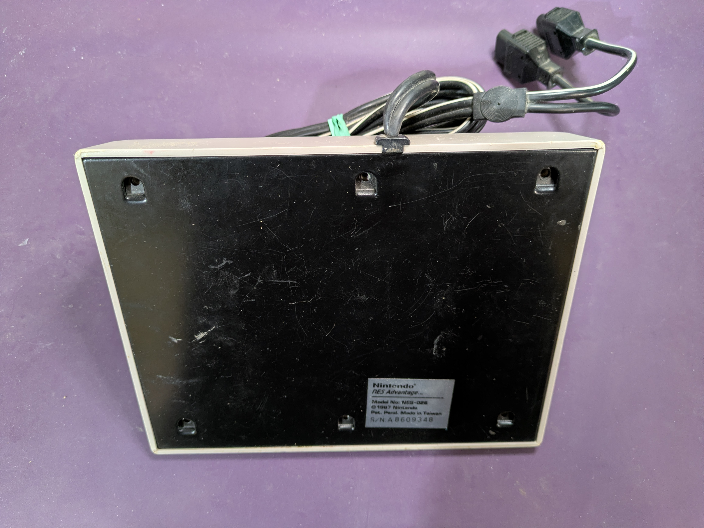
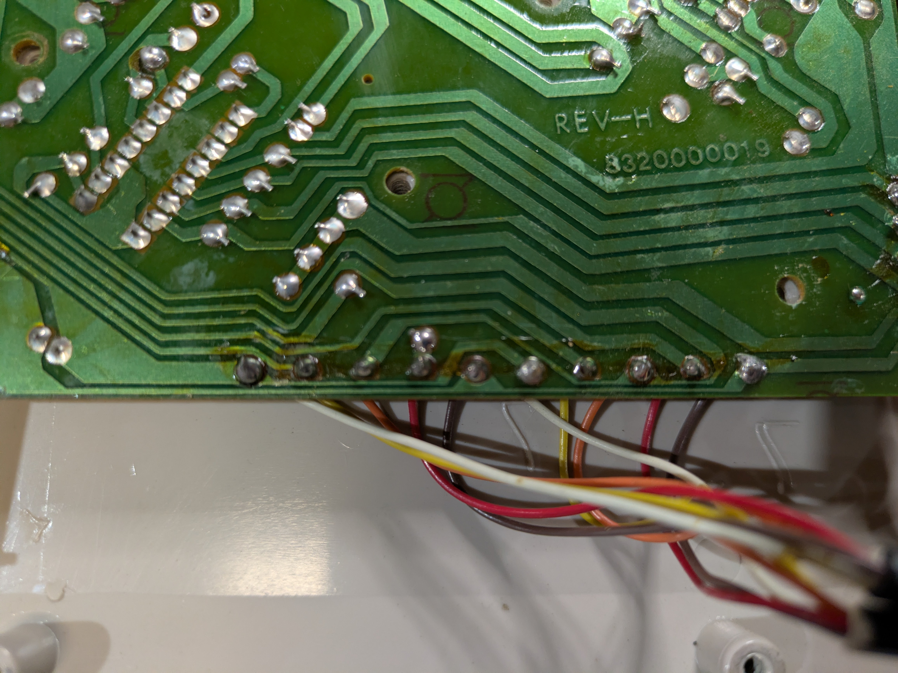
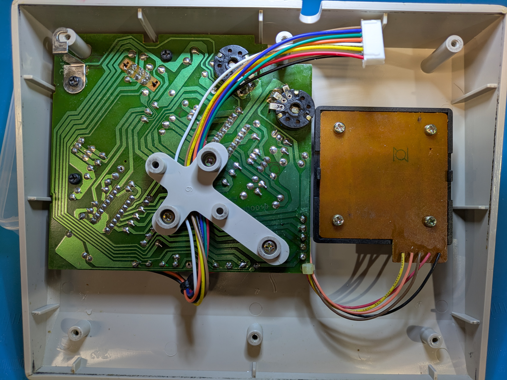
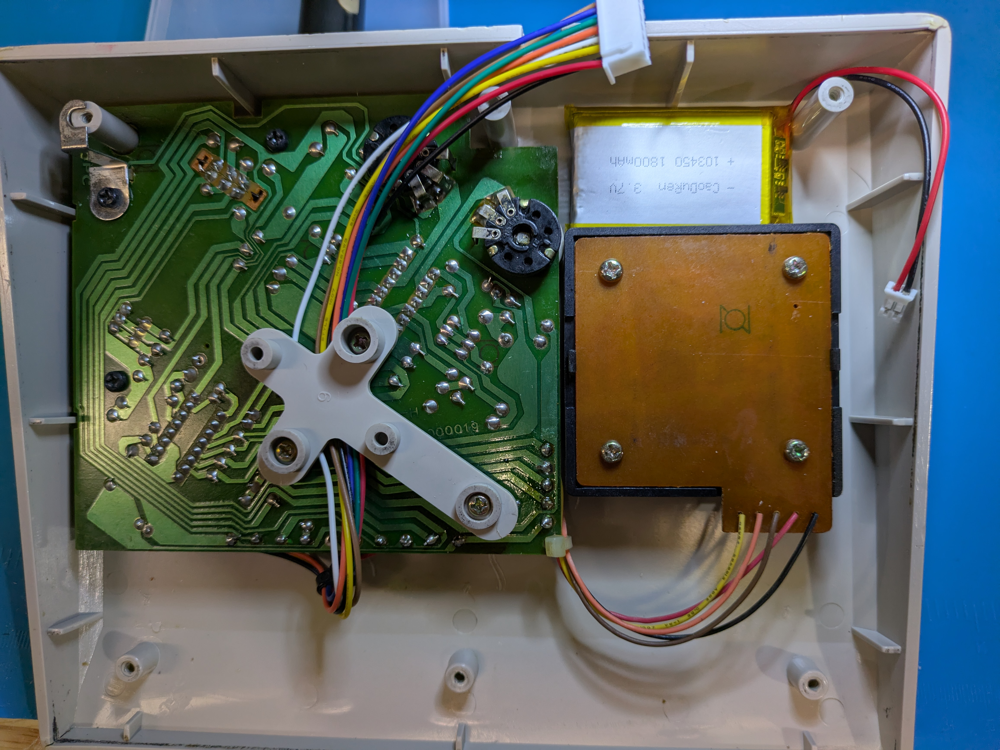
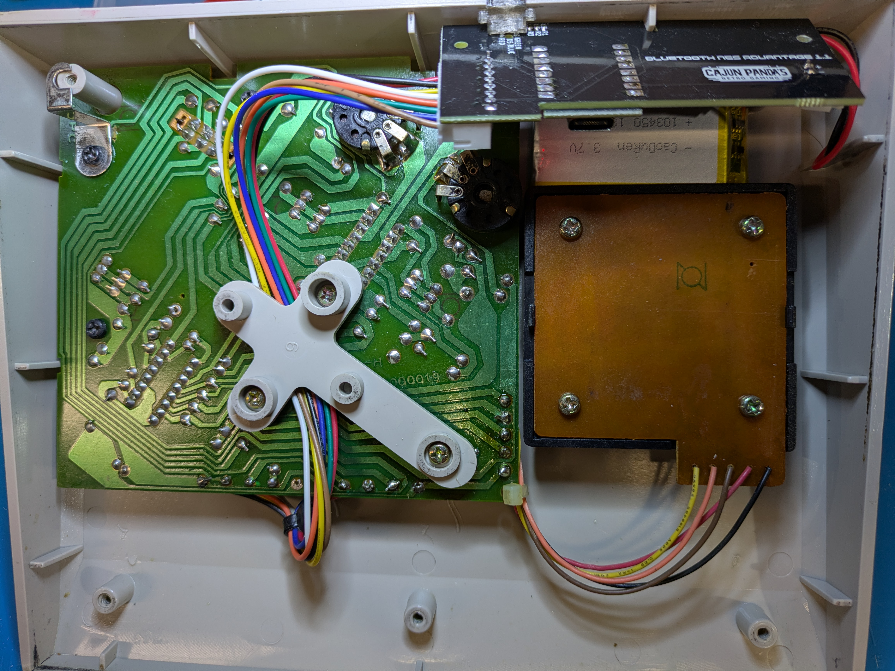

# Installation

How to install the Bluetooth NES Advantage board into an NES Advantage (NES-026) controller. No
case cutting: the board replaces the controller's cable and its jack sits in the original cable
hole. This covers both a board you built yourself and a prebuilt board or kit.

## What you need

- The Bluetooth NES Advantage board, flashed with firmware. A self-built board needs its first flash
  over the Tag-Connect cable (see [FIRMWARE.md](FIRMWARE.md)); kit and prebuilt boards ship
  pre-flashed.
- A 1S LiPo battery (JST-PH, 1500 to 2000 mAh) and an 8-pin JST-XH harness cable. See
  [Accessories and tools](HARDWARE.md#accessories-and-tools) for specific parts.
- A soldering iron, insulating tape, and a small screwdriver.
- The 3D-printed DC jack plug (step 7).

## 1. Open the controller

Remove the screws in the base and lift off the metal back plate. Full teardown video:
[NES Advantage Clean and Teardown](https://youtu.be/Sw1IDFrGwic).

## 2. Remove the original cable

The controller's flat cable is soldered to a row of pads along the bottom edge of the internal PCB.
Desolder it. Those same pads carry the signals the board reads.

## 3. Solder the harness

Solder the 8-pin JST-XH harness to the controller. J2 pinout, matching the labels on the board silk:

| J2 pin | Signal  | Controller side    |
| ------ | ------- | ------------------ |
| 1      | DATA_0  | P1 4021 serial out |
| 2      | LATCH   | P1 4021 latch      |
| 3      | CLOCK_0 | P1 4021 clock      |
| 4      | DATA_1  | P2 4021 serial out |
| 5      | CLOCK_1 | P2 4021 clock      |
| 6      | LATCH   | P2 4021 latch      |
| 7      | +3.3V   | Controller supply  |
| 8      | GND     | Controller ground  |

The supply wire carries 3.3 V, and the latch line gets its own conductor to each shift register (J2
pins 2 and 6 are the same net). The controller's internal schematic is in
[`nes_advantage_schematic.svg`](nes_advantage_schematic.svg).

Route the wires clear of the joystick plate.
J2.

## 4. Place the board and battery

Set the battery in the open floor area and plug the harness into J2, with the board aligned so its
jack sits in the original cable hole.

## 5. Connect the battery

Check polarity against the board's + and - silk marks first; there is no standard JST-PH polarity.

## 6. Insulate and reassemble

Put insulating tape on the metal back plate before reassembling.

## 7. Fit the DC jack plug

A 3D-printable plug fills the cable hole around the jack. Print it in transparent PLA so the status
LEDs show through. STL and FreeCAD source:
[`../hardware/bt-nes-advantage-jack-plug/`](../hardware/bt-nes-advantage-jack-plug/)

## Done

Power on by holding Start, then pair. See [MANUAL.md](MANUAL.md) for pairing, gestures, and LEDs.

## Troubleshooting

If the board can't reach the controller it boots into config mode with the red LED blinking, and the
config page shows "No controller detected on J2". Common causes:

- A loose harness or a cold or bridged solder joint at J2 or on the controller board.
- A dirty player-select switch. If both players read as deselected the board sees no data; clean the
  switch contacts.
- The metal back plate shorting the J2 connector. Make sure it is insulated (step 6).

In the config page's controller tester, toggle the player-select slider: if the warning clears on
one side but not the other, that side's DATA/CLOCK/LATCH wiring is the problem.
