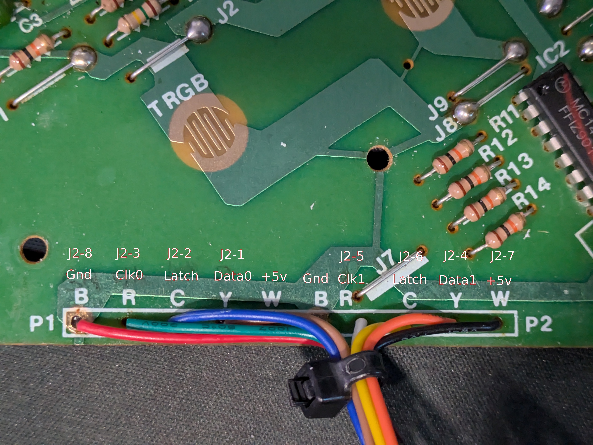
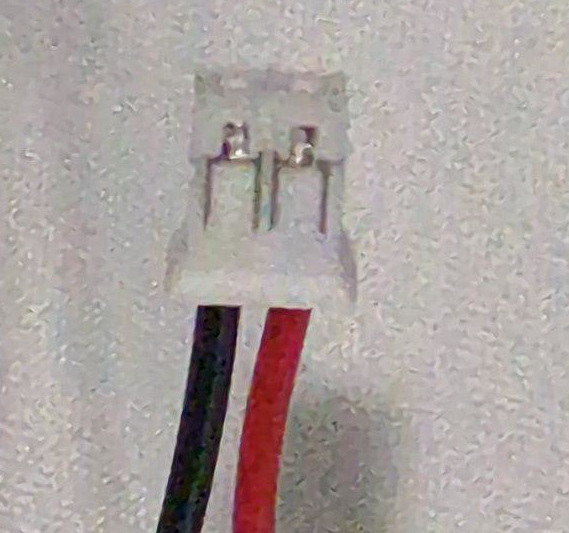
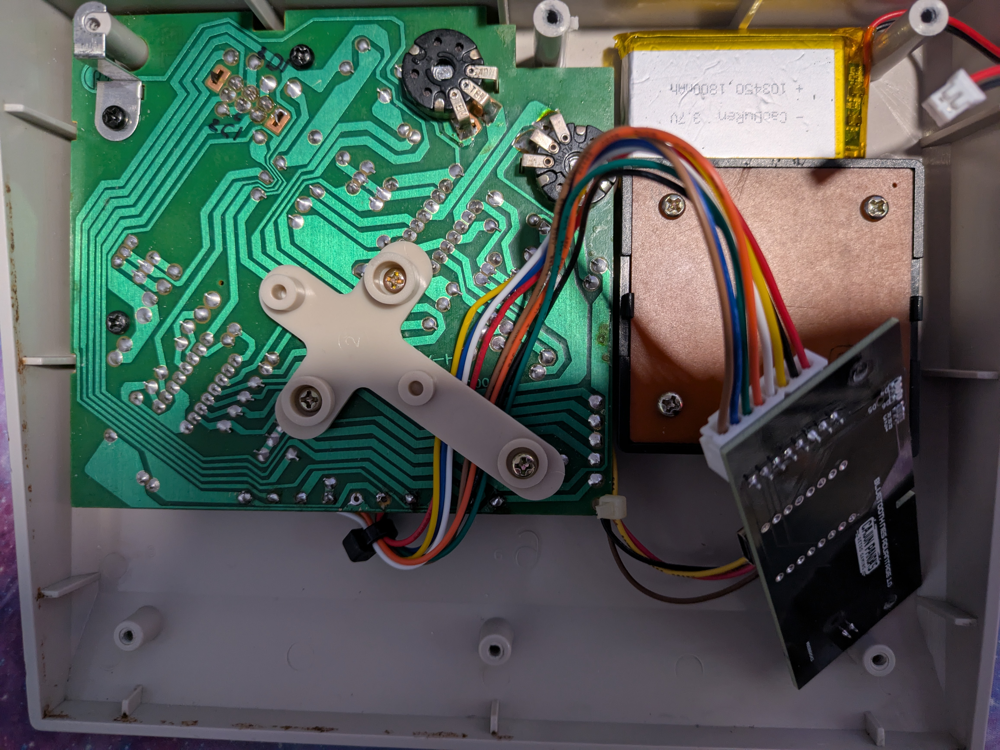
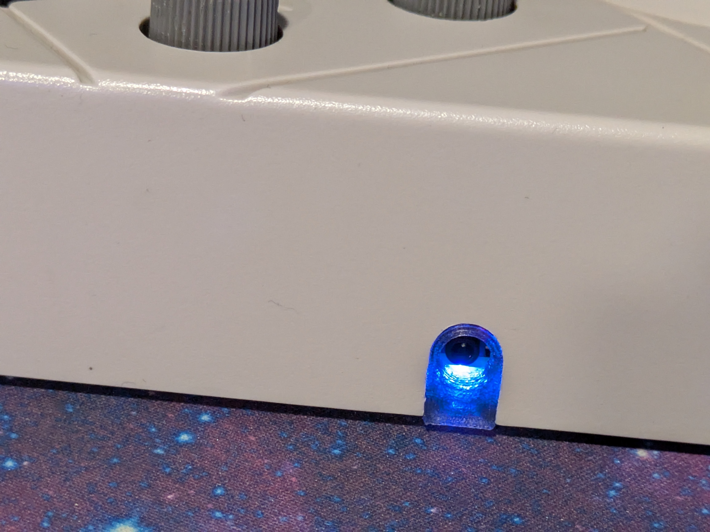
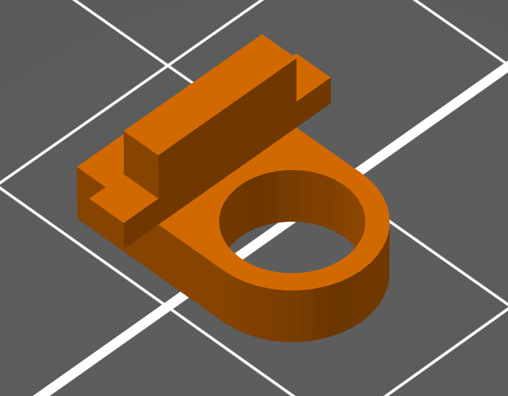

# Installation

How to install the Bluetooth NES Advantage board into an NES Advantage (NES-026) controller. This
covers a board you built yourself and a prebuilt board or kit. No case cutting: the board replaces
the controller's cable and the jack sits in the original cable hole.

## What you need

- The Bluetooth NES Advantage board, flashed with firmware. A self-built board needs its first flash
  over the Tag-Connect cable (see [FIRMWARE.md](FIRMWARE.md)); kit and prebuilt boards ship
  pre-flashed.
- A 1S LiPo battery (JST-PH, 1500 to 2000 mAh) and an 8-pin JST-XH harness cable. See
  [Accessories and tools](HARDWARE.md#accessories-and-tools) for specific parts.
- Insulating tape and a small screwdriver.
- The 3D-printed DC jack plug (step 6).

## 1. Open the controller

Remove the screws in the base and lift the back off. Full teardown video:
[NES Advantage Clean and Teardown](https://youtu.be/Sw1IDFrGwic).

## 2. Wire the harness to the controller

Wire the 8-pin harness from J2 to the controller. J2 pinout, matching the labels on the board silk:

| J2 pin | Signal | Controller side |
|---|---|---|
| 1 | DATA_0 | P1 4021 serial out |
| 2 | LATCH | P1 4021 latch |
| 3 | CLOCK_0 | P1 4021 clock |
| 4 | DATA_1 | P2 4021 serial out |
| 5 | CLOCK_1 | P2 4021 clock |
| 6 | LATCH | P2 4021 latch |
| 7 | +3.3V | Controller supply |
| 8 | GND | Controller ground |

The supply wire carries 3.3 V, and the latch line gets its own conductor to each shift register
(pins 2 and 6 are the same net). The controller's internal schematic is in
[`nes_advantage_schematic.svg`](nes_advantage_schematic.svg).

## 3. Connect the battery

Check polarity against the board's + and - silk marks first; there is no standard JST-PH polarity.

## 4. Place the board and battery

Battery in the open floor area, board aligned so the jack sits in the original cable hole.

## 5. Insulate and reassemble

Put insulating tape on the metal back plate before reassembling.

## 6. Fit the DC jack plug

A 3D-printable plug fills the cable hole around the jack. Print it in transparent PLA so the status
LEDs show through. STL and FreeCAD source:
[`../hardware/bt-nes-advantage-jack-plug/`](../hardware/bt-nes-advantage-jack-plug/)

## Done

Power on by holding Start, then pair. See [MANUAL.md](MANUAL.md) for pairing, gestures, and LEDs.
