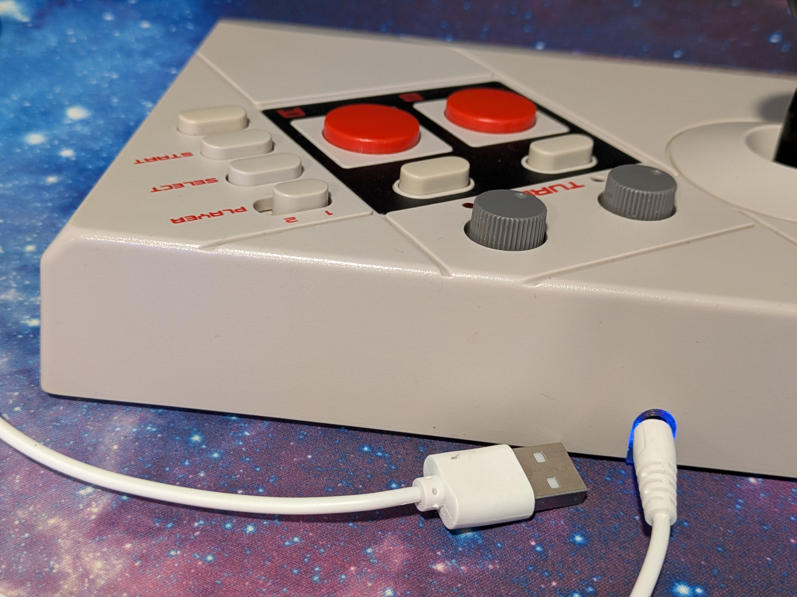
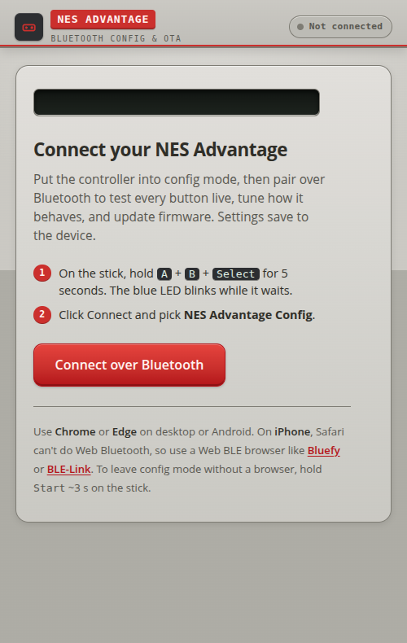
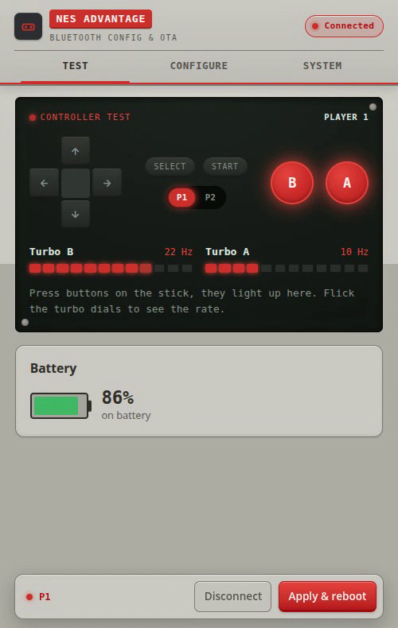
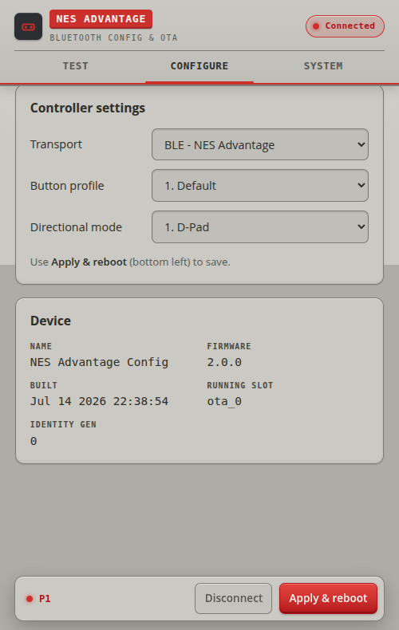
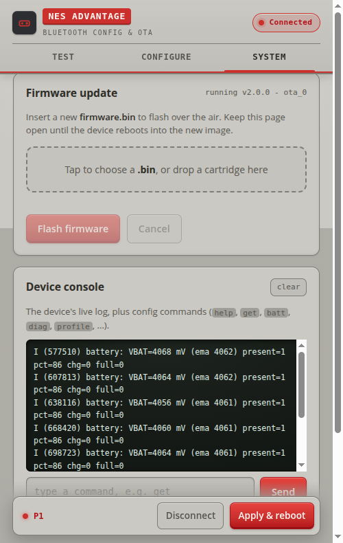

# Manual

How to use a Bluetooth NES Advantage. Everything is driven from the stick's own controls; there
are no added buttons.

## Charging

Plug a 5 V supply into the DC jack. The green LED blinks while charging and is solid when full.
You can play while charging.

## Pairing

1. Charge it if needed.
2. Pick the mode with a gesture (see Gestures below): Switch / Receiver (default) or BLE.
3. Pair:
   - **Nintendo Switch and Switch 2:** open Controllers, then Change Grip/Order. The stick appears
     as a Pro Controller. The blue LED blinks while pairing and is solid once connected.
   - **8BitDo Retro Receiver:** put the receiver in pairing mode and wake the stick. Pairing takes
     a few seconds (the stick waits for the host briefly, then completes the connection itself).
   - **BlueRetro (BT Classic):** press BlueRetro's pair button and wake the stick. Expect a few
     connect/disconnect cycles for the first ~20 seconds while BlueRetro's pairing mode settles;
     the link then holds. (BlueRetro also works over the BLE transport.)
   - **BLE (PC, phone, emulator):** switch to BLE mode, then pair "NES Advantage" from the
     device's Bluetooth menu.
4. Play. The stick reconnects to the last host automatically on wake.

**Nintendo Switch 2:** pairs directly from Change Grip/Order, exactly like a Switch 1. No adapter
needed.

**If a Switch 2 won't pair with anything**, including controllers that worked yesterday, power it
off completely (hold Power, then Power Options, Turn Off) and try again. Sleep is not enough. A
Switch 2 in this state connects to a controller and then drops it a fraction of a second later,
every time.

## Gestures

Hold the listed buttons together for about 5 seconds, then release. The LED blinks to confirm.
Gestures work any time during play. For any gesture that uses A or B, turn the Turbo dials off
first: turbo pulses those buttons, so the hold won't register with it on.

| Hold for 5 s | Does | Confirm |
|---|---|---|
| Start | Sleep (power down) | LEDs off |
| Select | Forget the paired host, re-pair from scratch | Blue blinks |
| Select + Start | Switch mode: Switch/Receiver or BLE (restarts) | Blue blinks |
| A + B + Up | Cycle button profile | Red blinks the profile number |
| A + B + Down | Cycle directional mode | Red blinks the mode number |
| A + B + Select | Enter config / firmware-update mode (restarts) | Blue blinks 3 times |

Hold **Start** to wake from sleep.

## Buttons the NES stick doesn't have

The Switch wants buttons an NES Advantage never had. Hold **Select** and press another button to
reach them. Unlike the gestures above these are instant, not 5-second holds, and they work mid-game:

| Hold Select, press | Sends |
|---|---|
| Start | Home |
| Up | ZL + ZR (opens the menu in NSO retro games) |
| Left | ZL |
| Right | ZR |
| Down | Capture (hold to record a clip) |

The button stays down for as long as you hold the chord, so Select + Down held records a video clip
the same way holding Capture on a Pro Controller does.

Select on its own is still Minus: it's sent when you *release* it, rather than when you press it, so
that reaching for a chord doesn't fire Minus first. Nothing else changes about it.

A few things worth knowing:

- **Press Select first**, then the other button. A direction you were already holding keeps steering
  — running right and tapping Select stays Right + Minus, it won't fire ZR. Let go of the direction
  and press it again if you want the chord.
- **Turn the slow-motion switch off** to use Select + Start. It pulses Start in hardware, the same
  way the Turbo dials pulse A and B, so it fires Home over and over. (It also pulses Plus into the
  game, so it isn't much use in play regardless.)
- The Turbo dials don't interfere: no chord uses A or B.
- Holding Select + Start for 5 seconds still switches mode, as above. You'll see the Switch's Home
  menu open on the way, which doesn't matter — the stick is reconnecting to something else anyway.

On the BLE transport these send buttons 5 (ZL), 6 (ZR), 7 (Home), and 8 (Capture) instead, since a
PC or emulator has no Home button to press.

## LEDs

| LED | Meaning |
|---|---|
| Blue solid | Connected to a host |
| Blue blinking | Pairing, waiting for a host |
| Blue off | Idle, not connected |
| Green blinking | Charging |
| Green solid | Fully charged |
| Red blinking | Battery low (under 20%) |
| Green and blue alternating, fast | Config / firmware-update mode |

In config / firmware-update mode the green LED blinks the whole time, alternating with blue, so you
can tell at a glance that the gesture took. Once the browser connects, blue goes solid and green
keeps blinking.

## Button profiles and directional modes

The stick remembers your choices per connection mode.

Button profiles (how NES A/B map onto the host):

| Mode | Profile 1 | Profile 2 |
|---|---|---|
| Switch / Receiver | Literal: A to A, B to B | NSO NES: A to B, B to Y (matches Switch Online NES games) |
| BLE | Default | BlueRetro (alternate mapping for BlueRetro adapters) |

Directional modes (where the joystick goes):

| Mode | 1 | 2 | 3 |
|---|---|---|---|
| Switch / Receiver | D-Pad | Left stick | Both |
| BLE | D-Pad | Axes | Both |

Most NES games on Switch want the NSO NES profile with D-Pad. Use the stick/axes modes for games
or menus that expect an analog stick.

## Player 1 / Player 2 (take-turns play)

The original player-select slider still works. It is built for hot-seat games like Super Mario
Bros., where two players share one stick. What it can do depends on the host, because one Bluetooth
radio can only be one controller to a console receiver:

| Connected to | Take-turns? | How |
|---|---|---|
| PC / emulator (BLE) | Yes | The stick shows up as two gamepads. Flip the slider to hand off; map each gamepad to a player in the emulator. |
| BlueRetro | Yes | Leave the slider on P1 and double-map the buttons to both wired ports in BlueRetro's config. |
| Nintendo Switch / Switch 2 | No | One Pro Controller is one player. The slider picks which player you report as. |
| 8BitDo Retro Receiver | No | One receiver occupies one NES port. Same as above. |

Set the slider before or while you pair.

## Sleep and battery

- Playtime on a full 1800 mAh cell: about 17 hours in Switch/Receiver mode, about 37 hours in BLE
  mode. Standby lasts months.
- Manual sleep: hold Start for 5 s. Hold Start to wake.
- Auto-sleep after 90 seconds with no host, or 5 minutes idle while connected. Stays awake while
  charging.
- Sleep is a deep sleep with the buttons still monitored; waking reconnects in about a second.

## Configuration and firmware updates

The controller has a built-in web app for testing every input, changing how it behaves, and
flashing new firmware — all over Bluetooth, no cable. It runs in Chrome or Edge (Web Bluetooth); on
iPhone use a Web BLE browser such as Bluefy.

### Enter config mode and connect

1. Hold **A + B + Select** for 5 s. The stick restarts into config mode and advertises as "NES
   Advantage Config"; the blue LED blinks while it waits.
2. Open the hosted config page at
   **<https://cajunpanda.github.io/bluetooth-nes-advantage/>**, click **Connect over Bluetooth**,
   and pick **NES Advantage Config**. The blue LED goes solid once connected.

The stick also boots straight into config mode if it cannot reach the controller board (a harness
or solder fault): the red LED blinks and the page shows "No controller detected".

### Test

The **Test** tab mirrors the stick live. Every button, the D-pad, Select and Start, the P1/P2
slider, and both turbo dials light up as you use them, with each turbo rate shown in Hz and a
battery gauge below. Toggle the player-select slider to check each side. Use this to confirm a
fresh install or track down a dead input.

### Configure

The **Configure** tab sets the three per-mode options — **Transport** (Switch/Receiver or BLE),
**Button profile**, and **Directional mode** — the same choices as the on-stick gestures, alongside
a readout of the device name, firmware version, and running OTA slot. Change what you want and press
**Apply & reboot** (bottom left) to save; the stick restarts into the new settings.

### Firmware updates (OTA)

The **System** tab flashes new firmware over the air. Drag a `firmware.bin` onto the cartridge slot
(or tap to choose one) and press **Flash firmware**. Keep the page open until the device reboots
into the new image. The update is written to the second OTA slot and SHA-256 verified before the
boot partition switches, so a bad upload leaves the running firmware untouched. The same tab has a
live device console — the stick's log plus the wired console commands (`help`, `get`, `batt`,
`diag`, `profile`, …) for troubleshooting.

### Leave config mode

Hold **Start** for about 3 s to return to normal play, or wait — it exits after 5 idle minutes. See
[`../web/README.md`](../web/README.md) for the GATT contract and full browser-support notes.
